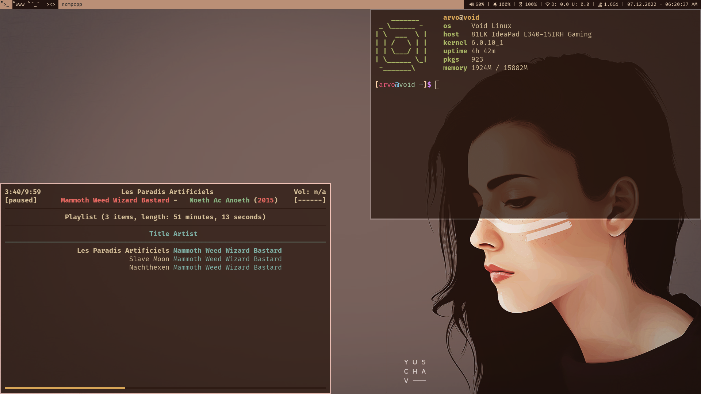
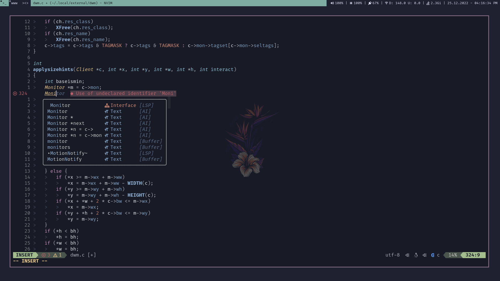

## My Minimal Void Linux Desktop
--------------------------------

Desktop dotfiles, scripts and other apps for portable dev environment.

Configs for:
* btop
* cava
* dunst
* firefox
* gtk-3.0
* htop
* mpd
* ncmpcpp
* nvim
* qutebrowser
* ranger
* sxhkd
* zathura

#### Usage
----------
Dotfiles are general for all distros, setmeup.sh installs packages using the xbps package manager.
Desktop currently uses:
* dwm
* dmenu
* st
* slstatus

#### How It Looks Like
----------------------
Desktop with terminal

Desktop with nvim

#### Then
---------
setmeup.sh is meant to be used for/after a base install when a connection to a network is established.
Run setmeup.sh inside HOME/repo.
